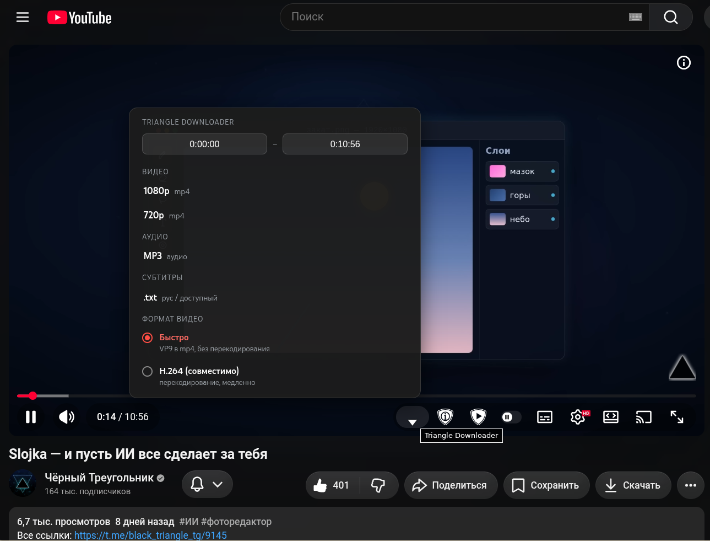

# Triangle Downloader

**Русский** · [English](README.en.md)

Расширение для Chrome (Manifest V3), которое добавляет кнопку ▽ прямо в плеер YouTube и
позволяет скачивать открытое видео, аудио и субтитры — перехватывая поток самого плеера.
Без `yt-dlp`, без сторонних сайтов и серверов: вся работа происходит локально в браузере.

## Возможности

- **Видео** — 720p / 1080p в `.mp4` (видео + звук).
- **Аудио** — `.mp3` (только звуковая дорожка).
- **Выбор фрагмента** — поля «начало — конец» в меню (по умолчанию `0:00:00` … полная длина
  ролика). Скачивается только выбранный отрезок.
- **Субтитры** — `.txt` без таймкодов. Приоритет — русский язык, иначе доступный.
- **Формат видео** — «Быстро» (VP9 в mp4 без перекодирования, секунды) или «H.264»
  (перекодирование для совместимости со старыми плеерами, медленно).
- **Авто-отключение автовоспроизведения** — расширение само выключает «Автовоспроизведение»
  YouTube, чтобы следующий ролик не запускался сам.

## ⚠️ Требования

- **Google Chrome** (или Chromium-браузер) с поддержкой Manifest V3.
- **Включённый блокировщик рекламы** (например, [uBlock Origin](https://ublockorigin.com/)).
  Это важно: без него YouTube вставляет рекламные вставки прямо в медиапоток, из-за чего
  захват может работать нестабильно или прерываться.

## Установка

1. Скачайте этот репозиторий (кнопка **Code → Download ZIP**) и распакуйте, либо
   `git clone`.
2. Откройте в Chrome страницу `chrome://extensions`.
3. Включите **Режим разработчика** (переключатель справа вверху).
4. Нажмите **Загрузить распакованное расширение** и выберите папку **`extension/`**.
5. Откройте любое видео на `youtube.com` — в правой части панели плеера появится
   кнопка ▽ (**Triangle Downloader**).

## Использование

1. Нажмите кнопку ▽ в плеере — откроется меню.
2. При необходимости задайте **начало** и **конец** фрагмента (по умолчанию — весь ролик).
3. Выберите, что скачать:
   - **Видео** → `1080p` или `720p`;
   - **Аудио** → `MP3`;
   - **Субтитры** → `.txt`.
4. Для видео можно переключить **Формат**: «Быстро» (по умолчанию) или «H.264».
5. Прогресс отображается во всплывающем окне; готовый файл сохраняется через стандартную
   загрузку браузера.

## Как это работает

YouTube в вебе раздаёт HD не одним файлом, а по протоколу **SABR**: видео и звук идут
раздельными зашифрованными потоками, которые плеер расшифровывает и склеивает в памяти
через Media Source Extensions. Готовой ссылки на файл не существует, поэтому расширение
подключается там, где данные уже расшифрованы и разложены по дорожкам:

1. **content_hook.js** (запускается до плеера) перехватывает медиасегменты в
   `SourceBuffer.appendBuffer`. Чтобы вшитый `ffmpeg.wasm` мог их обработать, плеер
   склоняется к кодеку **VP9** (AV1 он не декодирует).
2. Для скачивания расширение ставит нужное качество и **перематывает видео к краю
   загруженного буфера**, пока не соберёт все сегменты выбранного отрезка (без ускоренного
   проигрывания — мягко для YouTube).
3. **offscreen.js** запускает `ffmpeg.wasm` и собирает итоговый файл (по умолчанию — быстрая
   склейка `-c copy`; для `.mp3` и режима «H.264» — перекодирование).
4. **Субтитры** берутся из встроенной панели «Расшифровка видео» (текст уже отрендерен в
   DOM), поэтому не нужны никакие токены и перехват сети.

## Ограничения

- Захват идёт через перемотку буфера, поэтому для очень длинных роликов занимает время,
  пропорциональное длине.
- Режим «H.264» и `.mp3` перекодируют средствами `ffmpeg.wasm` (однопоточный) — это заметно
  медленнее быстрой склейки, вплоть до нескольких минут на длинных видео.
- В режиме «Быстро» файл `.mp4` содержит кодеки VP9/Opus — он открывается в Chrome, VLC и
  современных плеерах; для старых плееров используйте «H.264».
- Работает на страницах `youtube.com/watch`.

## Компоненты сторонних разработчиков

`extension/vendor/ffmpeg/` содержит сборки [ffmpeg.wasm](https://github.com/ffmpegwasm/ffmpeg.wasm):
пакеты npm `@ffmpeg/ffmpeg@0.12.10` и `@ffmpeg/core@0.12.6` (однопоточная сборка, не требует
cross-origin isolation).

## Лицензия

Проект распространяется под лицензией **GNU General Public License v3.0** — см. файл
[LICENSE](LICENSE).

## Авторы

- **Black Triangle** — автор и владелец проекта.
- **Claude** (Anthropic) — разработка кода.
